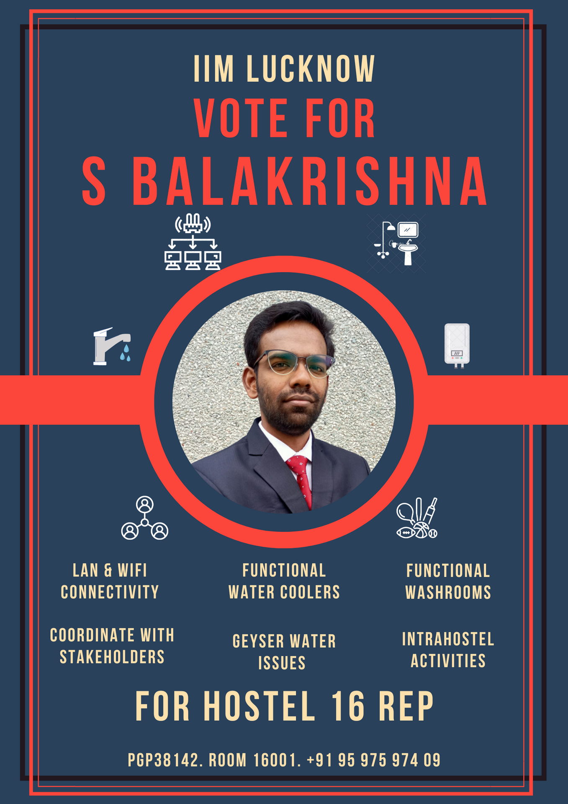

<video src="https://user-images.githubusercontent.com/109454786/180874182-01aa8f38-9d3d-4318-9243-dfb32e9f4c7a.mp4" controls="controls" style="width: 100%; height:auto">
</video>

## About me
Hey! This is S Balakrishna - PGP38142, Room 16001, Hostel 16. I am standing for the post of Hostel 16 Representative.
- I was the first person of PGP38/ABM19/FPM23 batch to come to this hostel
- I helped quite a few people with their lan/internet connectivity issues and still do
- I am active on the hostel 16 group, always ready to extend help whenever I can

* * *

## Objective
1. Keep in touch with IIML computer centre over stable LAN connectivity; help getting hardware/router issues resolved ASAP 
2. Coordinate with staff to fix bathroom stalls whose doors don't close / whose water taps are not working
3. Fix Geyser & water cooler problem - All floors should have at least one working geyser and 1 hot water tap on both sides
4. Assist you in case your room issues - such as problems with mattress, electrical issues, are not resolved on time
5. Arrange intra-hostel activities such as cricket, football, chess, badminton
6. Coordinate with concerned stakeholders to improve services

* * *

## Agenda.docx (submitted to Senate)

[Agenda](./PGP38142_16.pdf)

---

## Voting (Tentative)

### Voting starts : 17:00:00 Hrs, 27-07-2022
### Voting concludes : 20:59:59 Hrs, 27-07-2022
